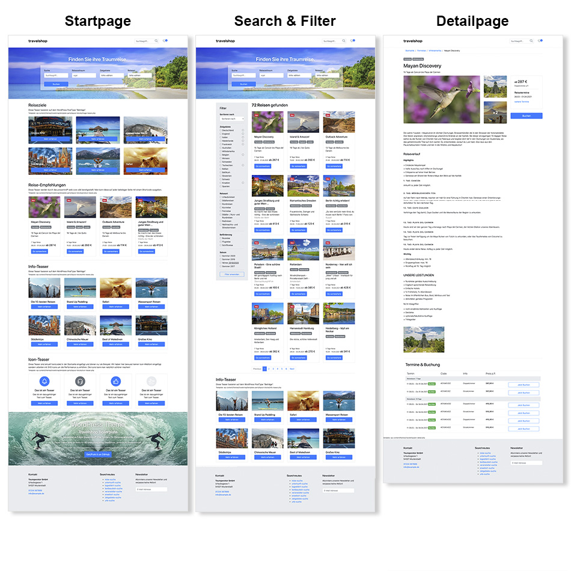
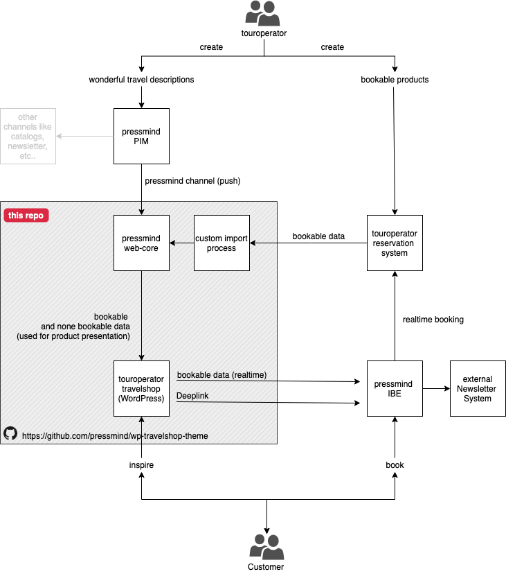

# Example travelshop
This is an example travelshop theme for WordPress.
It is based on the  [pressmind® SDK](https://github.com/pressmind/sdk)

#### Demo page
[https://travelshop-theme.pressmind.de](https://travelshop-theme.pressmind.de)

#### Screenshot

#### What is it not?
* It is not the pressmind's truetravel source, it is just a WordPress integration example for the [pressmind® SDK](https://github.com/pressmind/sdk)
* A full featured, plug & play travelshop.
* It is not a booking engine, but you can integrate your own booking engine or you can use the pressmind® IB3 booking engine.

#### What is it?
* A good starting point for developing a WordPress based travelshop based on the pressmind® PIM.
* The travelshop matches the german tour operator market.

#### For freelance web developers & agencies
If you are planning a travelshop for german (DACH) tour operators, it is possible to use this theme as a starting point for your project.
Keep in mind that you need pressmind®, so you do not build or integrate complex booking technology.

In most cases this is the basic setup for each travelshop:
* pressmind® Professional (PIM-System for tour operators)
* pressmind® IB3 (seamless booking engine, with connectors to a lot of german tour operator systems like BusPro, Blank, DaVinci, TouPac, turista 2/3, STADIS)
* [pressmind® SDK](https://github.com/pressmind/sdk) or this theme

#### Features
* Display different tourism based products (packages, hotels, round trips, day trips, etc.)
* List products in a defined order
* Search products by defined attributes
* Search by travel date
* Search by duration range
* Search by price range
* Search by text
* Display cheapest available price
* Display bookable content, delivered by tour operator systems
* Link to an external IBE like pressmind IB3
* Image handling: Thumbnailer, optimization
* Amazon S3 support
* ... and many more

#### System overview

#### More Information:
* [Installation Documentation](./travelshop/installation.md)
* [Common Theme Documentation](./travelshop/readme-theme.md)

#### How to generate product lists? 
It is possible to output product listings on three different ways:

* list by the media object default list route by GET params
* list by shortcodes
* list by the default pressmind SDK framework

For examples and more information look at the 
theme specific [QueryString API](./travelshop/readme-querystring-api.md)

#### Theme developer documentation
Take a look at the [pressmind web-core project](https://github.com/pressmind/web-core-skeleton-basic/#quickstart), 
most of the pressmind sdk implementation in this theme is based on those examples.

