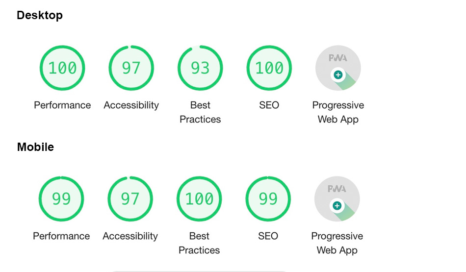

# WordPress travelshop theme
This is a responsive travelshop theme for WordPress.
The frontend is based on pure bootstrap components and a few common web libraries.
The backend is based on the pressmind® PIM system and the [pressmind® SDK](https://github.com/pressmind/sdk).
This theme is the perfect starting point in order to build professional travelshops.

#### Demo page
[https://travelshop-theme.pressmind.de](https://travelshop-theme.pressmind.de)

#### Screenshot

### Lighthouse Performance
Current lighthouse performance at revision 3de848c (10.05.2021)
(tested on demo page, without redis caching). 

### Mobile experience

### Progressive Web App  
Basic PWA support is enabled. Page can be used as PWA in online mode. 
The service worker provides a offline page if no network is available. 
Use workbox if you plan a offline mode or a advanced local caching strategy.

### Additional information
#### What is it not?
* It is not the pressmind's truetravel source, it is just a WordPress integration example for the [pressmind® SDK](https://github.com/pressmind/sdk).
* A full featured, plug & play travelshop.
* It is not a booking engine, but you can integrate your own booking engine or you can use the pressmind® IB3 booking engine.

#### What is it?
* A good starting point for developing a WordPress based travelshop based on the pressmind® PIM.
* The travelshop matches the german tour operator market.

#### For developers
If you are planning a travelshop for german (DACH) tour operators, it is possible to use this theme as a starting point for your project.
Keep in mind that you need pressmind®, so you do not build or integrate complex booking technology.

In most cases, this is the basic setup for each travelshop:
* pressmind® Professional (PIM-System for tour operators) see [pressmind.de](https://www.pressmind.de)
* pressmind® IB3 (seamless booking engine, with connectors to a lot of german tour operator systems like BusPro, Blank, DaVinci, TouPac, turista 2/3, STADIS)
* [pressmind® SDK](https://github.com/pressmind/sdk) or this theme
* for custom ux design take also a look at [Google UX Playbook for travel](https://services.google.com/fh/files/events/pdf_travel_ux_playbook.pdf)

### Features
* Display different tourism based products (packages, hotels, round trips, day trips, etc.)
* List products in a defined order
* Search products by defined attributes
* Search by travel date
* Search by duration range
* Search by price range
* Search by text (with auto-complete suggestions)
* Display cheapest available price
* Display bookable content, delivered by tour operator systems
* Fav-List feature
* Link to an external IBE like pressmind IB3
* Image handling: Thumbnailer, optimization
* Amazon S3 support
* Travelblog
* ... and many more

### Device compatibility
- iPhone 5 - iPhone X, portrait/landscape
- iPad (Pro), portrait/landscape

### Browser
* IE > 11
* Edge (current)
* Chrome (current)
* Firefox (current)

### Plugin compatibility (tested)
* Revolution Slider
* Elementor
* ... all other (but test make a deep test before use in production)

#### System overview

#### More Information:
* [Step by step guide for installation & customization](./travelshop/readme-step-by-step-guide.md) (!recommend for onboarding)
* [System requirements](./travelshop/readme-system-requirements.md)
* [Installation Documentation](travelshop/readme-installation.md)
* [Maintenance & troubleshooting](./travelshop/readme-maintenance.md)
* [Common Theme Documentation](./travelshop/readme-theme.md)
* [Shortcodes](./travelshop/readme-shortcodes.md)
* [Multilanguage Support](./travelshop/readme-multilanguage.md)
* [Build in pressmind® IB3 template](./travelshop/readme-ibe-template.md)
* [Using the blog feature](./travelshop/readme-blog.md)

#### How to generate product lists? 
It is possible to output product listings on three different ways:

* list by the media object default list route by GET params
* list by shortcodes
* list by the default pressmind SDK framework

For examples and more information see the 
theme specific [QueryString API](./travelshop/readme-querystring-api.md)

#### Theme developer documentation
Take a look at the [pressmind web-core project](https://github.com/pressmind/web-core-skeleton-basic/#quickstart), 
most of the pressmind sdk implementation in this theme is based on those examples.
