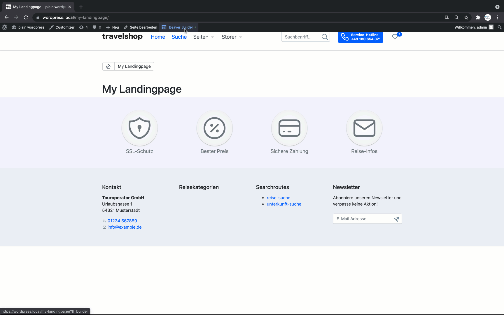

# Using BeaverBuilder
This theme has several beaver builder modules included.
The most important module is the ```pm-product-teaser```, this module allows to 
place pressmind based media objects (like products) on every page you like (without a shortcode).

Current tested and compatible beaverbuilder version: **2.4.2.5** (older and new version might work, test it)

## Overview:

* [What can i do with BeaverBuilder in this theme?](#what-can-i-do-with-beaverbuilder-in-this-theme)
* [Module overview](#module-overview)
* [Activate BeaverBuilder support](#activate-beaverbuilder-support)
* [Current developing state of ```pm-product-teaser```](#current-developing-state-of-pm-product-teaser)
* [Demo](#demo)

## Demo


## What can I do with BeaverBuilder in this theme?
In short: Build awesome landingpages. 
Our focus on developing is that you can build beaverbuilder pages with the post type "page".
Currently we don't support the post type 'post' in the theme.

### Module overview:
* jumbotron (yet another jumbotron)
* icon-teaser (yet another usp/icon teaser)
* pm-search-bar (searchbar only)
* pm-search-header (searchbar in hero style with title and background image)
* wp-image-teaser (teaser for posttype page or teaser)
* wp-info-teaser (teaser for posttype page or teaser)
* pm-product-teaser (**the main thing**: the beaverbuilder module to place pressmind objects)

## Activate BeaverBuilder support

Fst, install the beaver builder plugin.

Go to config-theme.php and set this line:
````php
define('PAGEBUILDER', 'beaverbuilder');
````

To setup recommend beaverbuilder (global) settings, like margins, paddings, etc, run this script on your commandline:
````shell
cd wp-content/travelshop/cli
php setup_beaverbuilder.php
````

Take also a look into the ``config-bb.php`` to edit further beaverbuilder specific settings 

## Current developing state of ```pm-product-teaser```
At this moment the most important search fields of the querystring api are supported, but not all!
So if you plan to use this module test it before! If you have a complex search query that you can't 
do with the module use the querystring api instead or solve it programmatically.

**So, what are the working search expressions?**
* Search by multiple categories (Scheme: multiple categories are chained with 'OR', multiple items inside a tree are chained with 'AND')
* Search by visibility
* Search by keyword (based on the defined fulltext index)
* Search by (multiple) ids/s
* Search by valid from/valid to date range
* Search by travel date range
* Search by travel duration range
* Search by travel price range

## Entry point for developers
```wp-content/travelshop/config-bb.php```<br>
```wp-content/travelshop/src/BeaverBuilderModuleLoader.php```<br>
```wp-content/travelshop/pagebuilders/beaverbuilder/*```