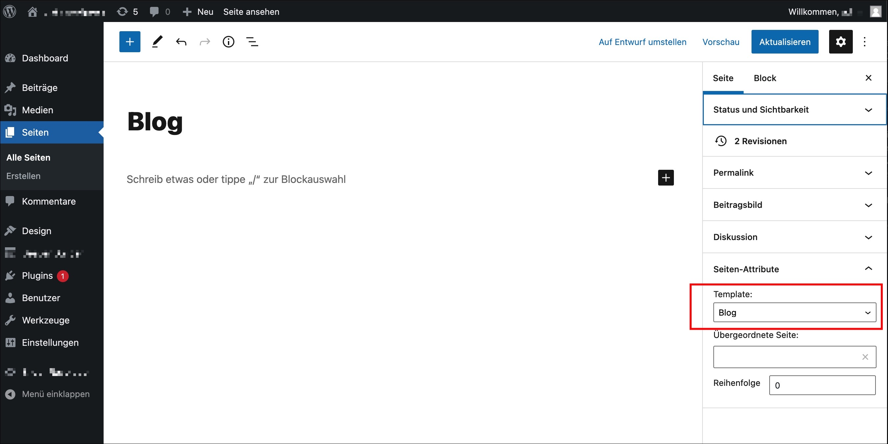

# Blog feature
If you want to use the origin wordpress blog feature in this theme,
please follow these steps:

## Step 1: Basic blog setup
1. Create a page and for example name it ```www.yourpage.com/blog/```
2. Select the page-template "Blog"

3. Place your page in the menu
4. Create your first blog posts and add tags and categories to this post
7. Ready!

## Step 2: Setup the "about the author"-box
1. Go to users and create or edit an author
2. Place a short author description in the bio-field. 
   (required! If this field is empty, the about box does not appear on the detail page)
3. Edit social links (optional)
4. Edit profile picture (optional)
5. Ready!

## Features:
The blog section in this theme is mostly nearby the wordpress codex. 

**Following features are included:**

* blog list
  * category menu
  * search
  * tag based navigation  
  * pagination
* blog detail page
    * enabled shortcodes
    * more posts
    * next/previos article
    * comments
    * about the author
        * social links added by this theme (see user profile)
* blog list by author
* blog list by date

## Entry points for developers:
* travelshop/posts.php
* travelshop/template-parts/content/content-post.php
* travelshop/author.php
* travelshop/category.php
* travelshop/comments.php

## FAQ
**How can i change the author per blog post?**<br>
Go to your post, find "Author" under "Status and Visibility" and change to author. 
(The author field appears only if you have more than one user/author)

**How can i change the amount blog list items?**<br>
Go to "Settings -> Reading", find "Blog pages show at most", change the amount.

**Can i place pressmind objects in the blog posts?**<br>
Yes, it's possible. Use the shortcodes as described [here](readme-shortcodes.md)
