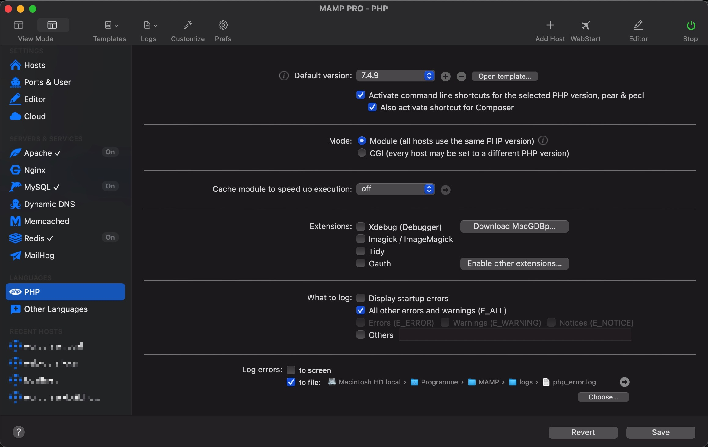
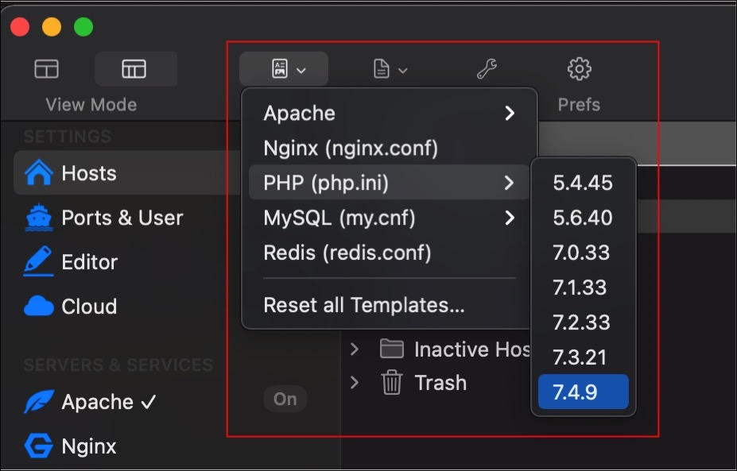

Document state: DRAFT

# Setup for developing
This theme is build with the following developing setup.

## Local developing environment

* Mac OS
* PHPStorm (with git, local deployment and these filewatchers: SCSS as scss compiler, CSSO as css minifier, UglifyJS as js minifier)
* MAMP Pro as simple to use local Apache, MySQL, PHP stack with a clean wordpress install
* composer  (for pressmind® sdk install and updates)
* pressmind® Pro as PIM client for generating and understanding products
* github.com for managing the repo

This is just an example, other setups might work, but it's highly recommend 
to use a *nix webserver for developing.  

## Overview
* [Setup MAMP Pro](#1-mamp-pro)
* [Install WordPress](#2-install-wordpress)

# Setup

## 1. MAMP Pro
Install MAMP and setup the local developing host ```wordpress.local```, see detailed configuration in the following screenshots:<br>

### Create a new host:
* Create new host, call it ```wordpress.local``` 
* It's recommend to setup the document root folder into your PhpStorm working directory
* Make the host reachable during your hosts file


### Configure Apache
* Setup the environent variable APP_ENV to enable the theme developing mode <br> ```Set ENV Variable APP_ENV development```


### Enable SSL 
* for better local testing experience create a ssl certificate for this host (it's easy during mamp's wizard)


### Configure MySQL
* create the database ```wordpress``` for the later installation of wordpress
* create the database ```wp-pm-web-core``` for the later installation of the travelshop theme
* map both databases to the host using the checkbox


### Check Ports


### Check PHP Version and settings


### Edit php.ini, http.conf 
Check the button "templates" in the main window for accessing the all config files. 

* goto ```php.ini`` and check if the following modules are enabled
    * imagick
    * pdo @TODO
    




## 2. Install WordPress
Download and unpack WordPress to your defined document root:
```shell
cd /Users/rbartel/wordpress
wget https://wordpress.org/latest.tar.gz
tar -xzvf latest.tar.gz --strip=1
```

Open your new developing host ```https://wordpress.local``` in a browser window 
and follow the wordpress installation instructions.
Make a clean WordPress installation. Do not install any plugin or special theme at this moment. 
Your ready here if WordPress is running with the default theme.

## 3. Setup PHPStorm project

- to be continued - 
