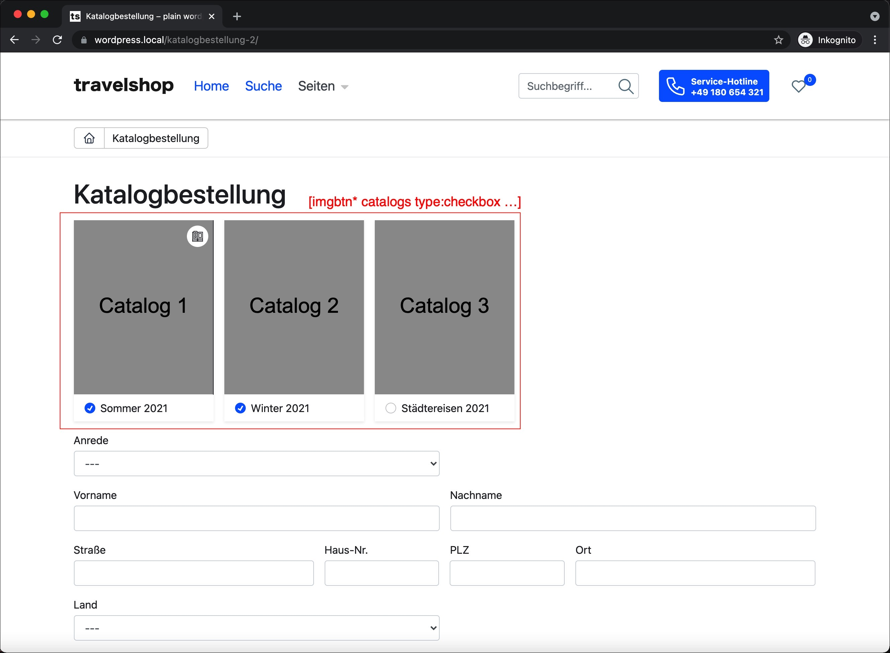
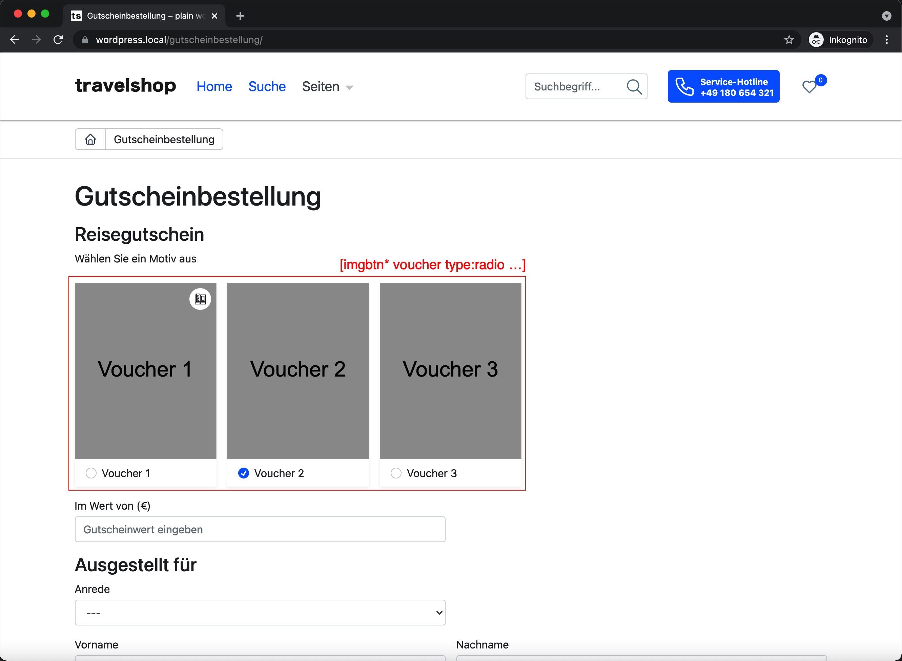

# Contact Forms 7 support

This theme extends the Contact Forms 7 Plugin with the following things:

## Features
* a the custom field/tag ``imgbtn`` (with this feature it's possible to build nice catalog-order or voucher forms for touroperators)
* several styles and example forms
* a tag for modal links that can be used in acceptance-tags

##Overview
* [Using imgbtn-tag](#example-usage-of-the-imgbtn-tag)
* [Syntax imgbtn-tag](#syntax-imgbtn)
* [Example forms](#example-forms)

## Example usage of the ``imgbtn-tag``:

### Example 1:<br>As checkbox-item in a catalog order form
Example usage of the imgbtn as catalog-order-form.<br>
Validation: **One or more** catalogs must selected. 
```
[imgbtn* catalogs type:checkbox 
"Voucher 1::img1.jpg::https://travelshop.de/flipcatalog/" 
"Voucher 2::img2.jpg" 
"Voucher 3::img3.jpg"]
```


### Example 2:<br>As radio-item in a voucher form 
Example usage of the imgbtn as voucher-order-form.<br>
Validation: **Only one** voucher can be selected.

```
[imgbtn* voucher type:radio 
"Voucher 1::img1.jpg::https://travelshop.de/flipcatalog/" 
"Voucher 2::img2.jpg" 
"Voucher 3::img3.jpg"]
```


### Syntax imgbtn
```
[imgbtn* {fieldname} type:{radio|checkbox(default)} 
"{label}::{image url}::{url to preview(optional)}" "..." ]
```

## Modal links in acceptance-tag

See [readme-modals.md](readme-modals.md#using-modals-in-contactform7-forms) for detailed information.

## Example forms

Use this examples as startingpoint for your contact forms. 
Simple copy the html from the files below into the CF7 form editor.

* [Catalog order form](cf7-examples/catalog-order-form.html)
* [Contact form](cf7-examples/contact-form.html)
* [Group travel request form](cf7-examples/grouptravel-form.html)
* [Voucher order form](cf7-examples/voucher-order-form.html)

Set this string into the "Additional-Settings"-tab to prevent that 
the acceptance-tag disables the submit button. (Optional).
```
acceptance_as_validation: on
```
