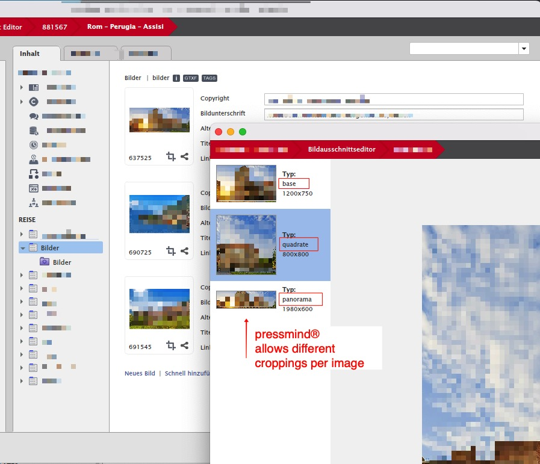

# Images

## How to place pressmind images

It is possible to define multiple image croppings in the pressmind® PIM system.
The theme generates for each image cropping a set of defined image derivates.

##Terminology
```section``` means a pressmind defined image format (the master) which defines the maximum size and ratio 
for generation each other derivate.<br>
```derivate``` means a custom image size which is defined in the pm-config.php file. 

## Example

| Type | Size  | Name | Usage |Description |
| --- | --- | --- | --- | --- |
| section  | 800x800 | square     | $image->getUri('square') | Defined image format in pressmind, cutout can be set. 
| derivate | 400x400 | square_400 | $image->getUri('square_400', false, 'square')| Resized image derivate for template usage.
| derivate | 100x100 | square_100 | $image->getUri('square_100', false, 'square') | Resized image derivate for template usage.

## How to get these images?

Example code:
(Gets the derivate 'square_400' from the section 'square')
```php
// 1.get the media object
$mo = new \Pressmind\ORM\Object\MediaObject(881567);

// 2. get the data for the current language
/**
 * @var \Custom\MediaType\Reise $moc
 */
$moc = $mo->getDataForLanguage();

// 3. loop trough each media object
foreach($moc->bilder_default as $image){    
    $uri = $image->getUri('square_400', false, 'square');
    echo '';
}
```

## Screenshot pressmind image cropping



