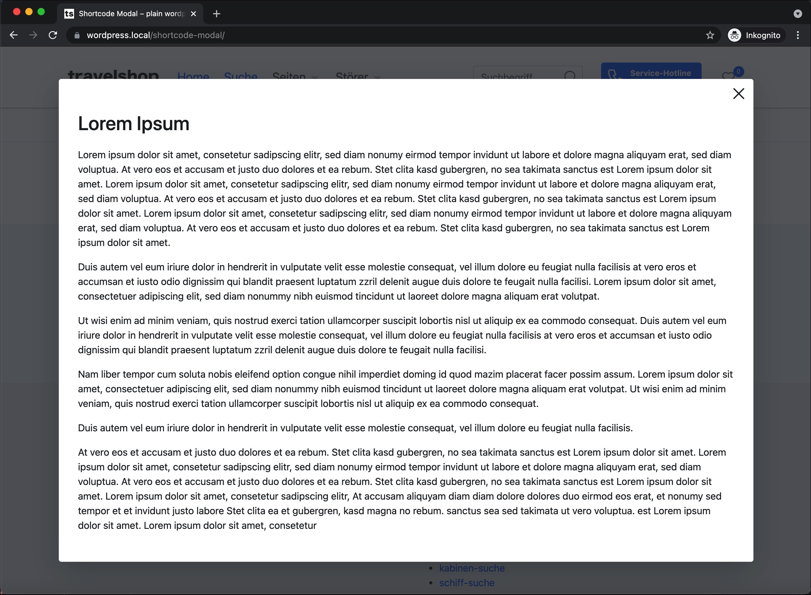

# Using modal screens

In some cases like showing disclaimers and so on, its required to display a modal screen. 

## Features
* display post or page content from a post-type id in a modal screen
* modal can closed by 'X' in the right top corner or by esc-button
* can also used in CF7-forms

# Screenshot


## Overview
 * [Create modal content](#create-the-modal-content-page)
 * [Modal method 1 () with generated link](#method-1-with-link)
 * [Modal method 2 () modal div only](#method-2-modal-div-only)
 * [Modals in CF7-Forms](#using-modals-in-contactform7-forms)

## Using modals

### Create the modal content-page
Simply create a page or post (don't use a page builder here, use the default WordPress Editor (Gutenberg)) and publish it.
The modal screen will use the content and the page title.

###Method 1 "with link":
This Shortcode creates a modal link, named as "Datenschutz" and also created the modal-div with it's content from the given post id. 
```html
[ts-modal id_post="124" name="Datenschutz"]
```

###Method 2 "modal div only":
This Shortcode renders only the modal-div with it's content from the given post id, and you have to place to place the link manually.
```html
<a href="#" data-modal="true" data-modal-id="modal-id-post-124">Click here</a>
[ts-modal id_post="124" create_div_only]
```

## Using modals in ContactForm7 forms
In CF7-forms no normal wordpress shortcodes are rendered, so we have to use a special cf7 syntax-based shortcode.

Example usage in a CF7-Form acceptance-Checkbox:
````html
<!-- draw the acceptance checkbox based on the cf7-syntax -->
[acceptance privacy]<b>Datenschutz &amp; Transparenz ist uns sehr wichtig!</b><br> 
Mit Absenden des Formulars, erklären Sie, dass Sie die 
<a href="#" data-modal="true" data-modal-id="modal-id-post-12">Hinweise zum Datenschutz</a> 
der Travelshop GmbH zur Kenntnis genommen und akzeptiert haben.[/acceptance]

<!-- render the modal content div -->
[modal privacy id_post:12]
````


