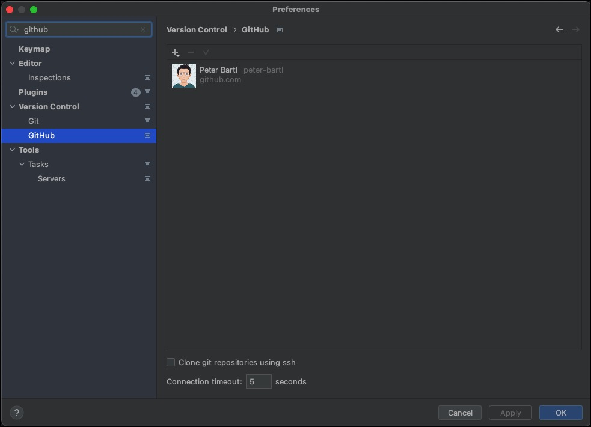
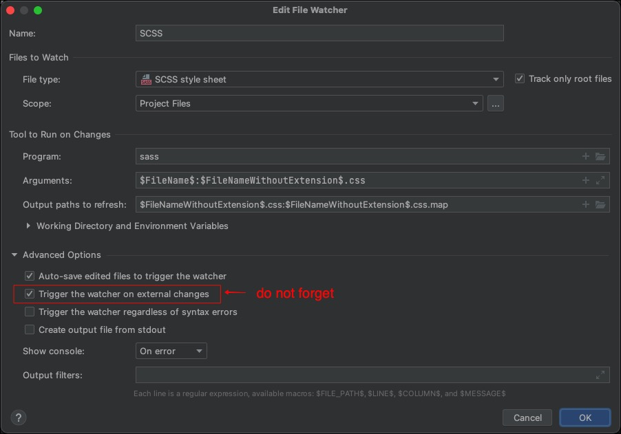

# PhpStorm Setup
This guide describes the initial and basic PHPStorm configuration.

## Project Configuration

### 1. Set your GitHub User


### 2. Clone Project
Select "Clone" from git menu (this menu is only available if any project is open)...


... or if no project is open, select "Get from VCS"  


After that, select your git account and select your travelshop repo


### 3. Define filewatchers
we have to create three filewatchers for:
* SCSS compiling (SCSS)
* CSS minifying (CSSO for example)
* JS minifying (UglifyJS for example)

Go to preferences and add the filewatchers:


Add the scss filewatcher<br>
See [PhpStorm docu for detailed scss filewatcher installation instructions](https://www.jetbrains.com/help/phpstorm/transpiling-sass-less-and-scss-to-css.html#install_sass_scss)


Add csso filewatcher<br>
See [PhpStorm docu for detailed csso filewatcher installation instructions](https://www.jetbrains.com/help/phpstorm/compressing-css.html#css_before_you_start)


Add uglifyjs js filewatcher<br>
See [PhpStorm docu for detailed uglifyjs filewatcher installation instructions](https://www.jetbrains.com/help/phpstorm/minifying-javascript.html)


Check if everything is working:
* Change a *.js file, the uglifyjs watcher creates automatically the *.min.js file
* Change a *.scss file, the scss watcher creates automatically the *.css file. After the css file is created, the csso filewatcher automatically creates the *.min.css file.


Change code, build your site and commit your stuff using commit 

### 5. Run composer install
Run composer from project root
```shell
composer install
```
This is only required for a better code completion. 

### 4. Add wordpress source to your external libs
Download wordpress source, extract it to a folder of your choice and set this as external library. 

Right click on "External Libraries" > "Configure PHP Include Paths"


Add the path to your wordpress source


### 6. Ready
Code, build and build awesome travelshops!
