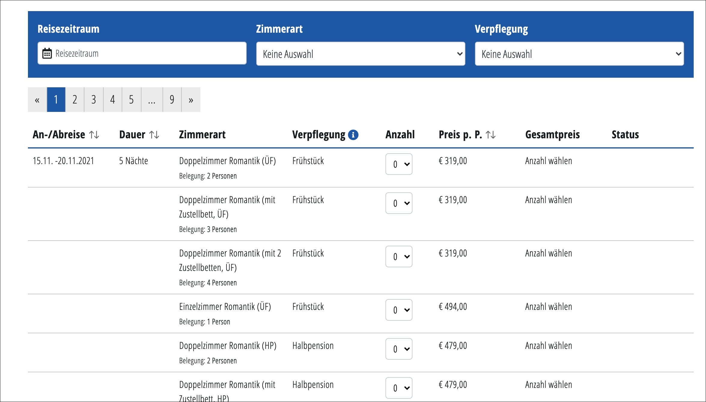

# pm-ajax-endpoint.php
This little ajax endpoint is designed to get simple and fast stuff from the backend...
It does NOT include the wordpress bootstrap to preserve speed. 
So if you plan to extend this file, don't use WordPress functions. If you plan to use WP-functions
use the build in wp-admin-ajax.php endpoint.

# Methods / Actions

## get Offers
Get offers for a defined media object.
```
GET pm-ajax-endpoint.php?action=offers&pm-id=123456
```

Parameters:

|  Parameter  | example value | description |
| --- | --- | --- |
| pm-id |12345 | required, pressmind media object id
| pm-l |0,10 | pagination, limit
| pm-du |5-5 | duration range 
| pm-dr |20211201-20211215 | date range

Result
```json
[
    {
        "id": 414872,
        "id_media_object": "1849409",
        "id_booking_package": "fgnkwcesdha",
        "id_housing_package": "fgnkwcesdhb",
        "id_date": "fgnkwcesdic",
        "id_option": "fgnkwcesdhc",
        "id_transport_1": "fgnkwcesdid",
        "id_transport_2": "fgnkwcesdim",
        "duration": 5,
        "date_departure": {
            "date": "2021-12-05 19:05:49.000000",
            "timezone_type": 3,
            "timezone": "Europe/Berlin"
        },
        "date_arrival": {
            "date": "2021-12-10 19:05:49.000000",
            "timezone_type": 3,
            "timezone": "Europe/Berlin"
        },
        "option_name": "Doppelzimmer Komfort",
        "option_code": "DBC",
        "option_board_type": "Frühstück",
        "option_occupancy": 2,
        "option_occupancy_min": 2,
        "option_occupancy_max": 2,
        "price_transport_total": 0,
        "price_transport_1": 0,
        "price_transport_2": 0,
        "price_mix": "date_housing",
        "price_option": 219,
        "price_option_pseudo": 0,
        "option_price_due": "person_stay",
        "price_regular_before_discount": 219,
        "price_total": 219,
        "transport_code": null,
        "transport_type": "PKW",
        "transport_1_way": 1,
        "transport_2_way": 2,
        "transport_1_description": "Eigene Anreise",
        "transport_2_description": "Eigene Abreise",
        "state": 1,
        "infotext": null,
        "earlybird_discount": 0,
        "earlybird_discount_f": 0,
        "earlybird_discount_date_to": null,
        "id_option_auto_book": 0,
        "id_option_required_group": 0,
        "id_start_point_option": null,
        "id_origin": 0,
        "id_startingpoint": null,
        "price_total_formatted": "219&nbsp;€",
        "ib3_url": "https://demo.pressmind-ibe.net/?imo=1849409&idbp=fgnkwcesdha&idd=fgnkwcesdic&idhp=fgnkwcesdhb"
    },
   ...
]
```

With this service its possible to build a offer table like this:

