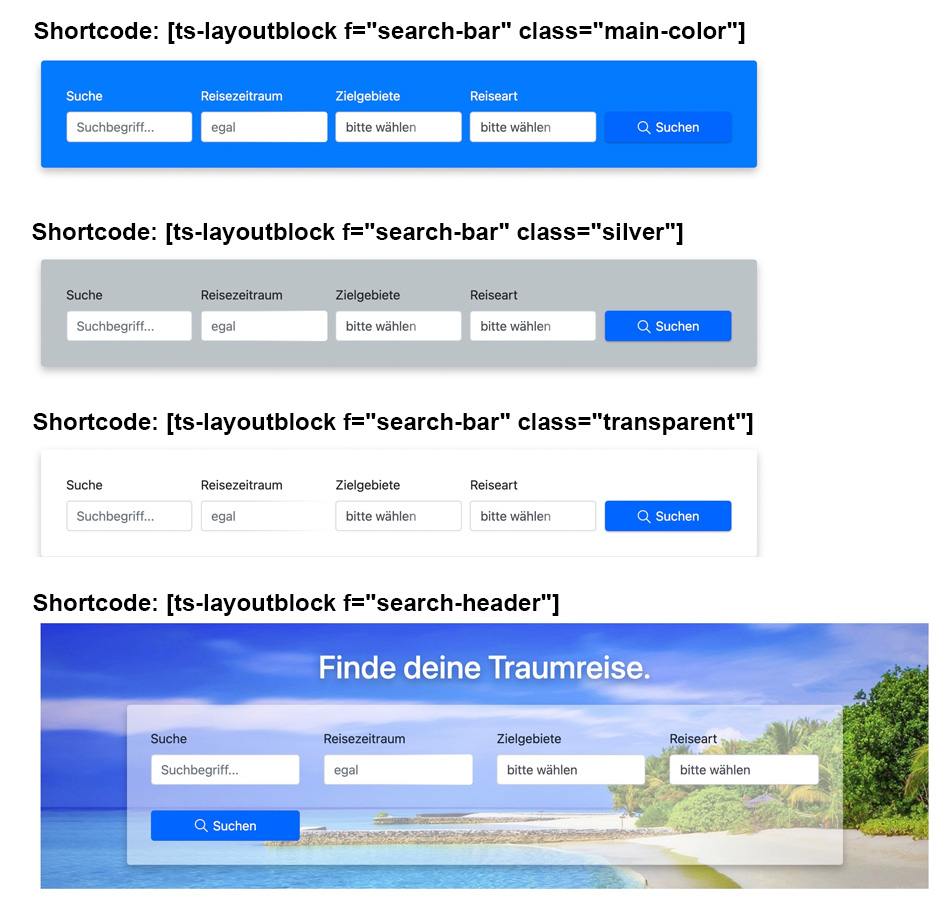

# Shortcodes

## 1. List products [ts-list]

This shortcode can create product lists based on media objects stored in pressmind PIM. 
There are **many parameters available**, look at the [QueryString API](readme-querystring-api.md) for a full documentation.

**Shortcode example:**
````
[ts-list view="Teaser1" pm-t="italy"]
````
This Shortcode shows all products that contain the term "italy" and uses the view "Teaser1" for display.
(All viewfiles are stored in /travelshop/template-parts/pm-views)


## 2. Display layoutblocks [ts-layoutblock]

This shortcode display a defined layoutblock template. Use this to add special views 
(like the searchbox) to pagebuilder or slider plugins. 
(All layoutblocks are stored in /travelshop/template-parts/layout-blocks)

Parameter:<br>
*f* = filename located in /travelshop/template-parts/layout-blocks (without extension)

**Shortcode example "search-header":**<br>
(Display the layoutblock /travelshop/template-parts/pm-views/search-header.php)
````
[ts-layoutblock f="search-header"]
````



**Shortcode example "search-bar":**<br>
(Display the layoutblock /travelshop/template-parts/pm-views/search-bar.php)
````
[ts-layoutblock f="search-bar" class="transparent"]
````


## 3. Get searchpage by object type constant
This shortcode delivers the default searchresultpage url for a given object type. 

Parameter:<br>
*page* = media object typ constant, (see config-theme.php)
````
[ts-searchpage page="TS_TOUR_PRODUCTS"]

--
Returns: 
https://www.travelshop.de/travel-search/
````


## 4. Display searchroutes [ts-searchroutes]
This shortcode displays all searchroutes which media object types are declared as primary in pm-config.php
````
[ts-searchroute]

--
Returns:
<ul>
    <li><a href="https://wordpress.local/travel-search/">travel-search</a></li>
    <li><a href="https://wordpress.local/hotel-search/">hotel-search</a></li>
</ul>
````

## 5. Display modal screens
This shortcode generates a link to a modal screen. See [readme-modals.md](readme-modals.md) for detailed informations.
````
[ts-modal id_post="124" name="Privacy"]

--
Returns:
<a href="https://wordpress.local/privacy/" data-modal="true" data-modal-id="modal-post-id-542">Privacy</a>
<div class="modal-forms modal-wrapper" id="modal-post-id-542">
    <div class="modal-inner">
        <button type="button" class="modal-close"><span></span></button>
        <div class="modal-body-outer">
            <div class="modal-body">
                <div class="h2 modal-title">Lorem Ipsum</div>
                <p>the content</p>
            </div>
        </div>
    </div>
</div>
````
