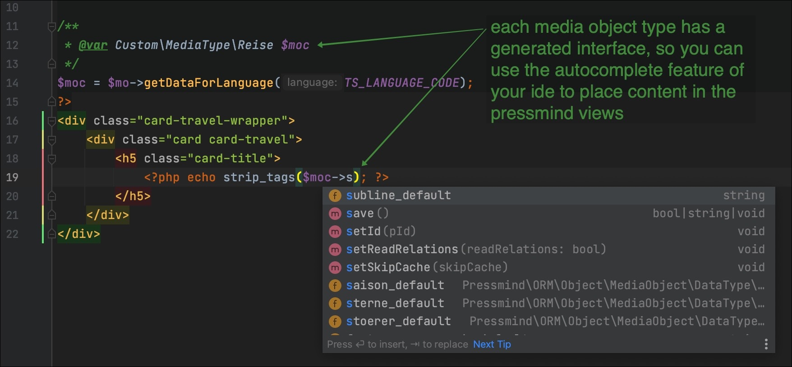

# Step by step guide for developers

### Topics in this guide

 1. [Preparation](#1-preparation)
 2. [Installation & Configuration](#2-installation--configuration)
 3. [Adapting the viewfiles](#3-adapting-the-view-files)


## 1. Preparation
Ensure that you have to following things:

__Server requirements:__
* a *nix webserver with commandline support (do not try this on a windows wamp stack)
* check [system requirements for detailed specs](readme-system-requirements.md)

__Credentials:__
* pressmind® API Creditials (get it from the pressmind team)
    * api key
    * username
    * password
    
__Project informations:__

Each pressmind system has a customer specific datamodel (called: media object types). 
So you need something to know about this types. Also the search function is based
on this types, it's very important for a good running project to understand the model.

__Informations about the media object types needed__ 
(get it from the pressmind team)
 * Which are the primary object types?
 * Which object types are used on the whole page?
 * Which object are child objects?

__Informations about the search__
 * What are the searchable values, how is the search configured?
    * you can use all categorytree-values (destinations, transport, stars, topics) from the defined media object type.
      If a categorytree is missing, it's possible extend the media object type (ask the pressmind team).
    * also it's possible to search by price, date and duration (see example theme setup). Be in mind that this search 
      conditions can consume a lot of database power (if you're customer brings a lot of travel dates and price combinations).
      In some cases you have to extend the travelshop for this custom use case with caching layers, in memory database or other solutions
      

This are the basic project informations we need to build a customer specific travelshop 
out of the box as your startingpoint for development.


## 2. Installation & Configuration
Run the basic installation process as described [here](readme-installation.md).

Edit the wp-config.php and enable error reporting with this lines:
```php 
define('WP_DEBUG', true);
define('WP_DEBUG_DISPLAY', true);
```
(remove this lines in production use)


### Fix php errors and warnings
Open your wordpress page in the browser and check for errors.<br>
It's possible that the theme brings some php errors or warnings,
please don't care (if you read the following lines).

Fst. check php errors and fix them (in most cases this are system environment specific things).

## 3. Adapting the view files:
If the installation and  import process is successfull done, 
we have to check all autogenerated view files. 


### Look at the view files
The installation process has created for each media object type  
different views which are located in this directory `travelshop/template-parts/pm-views/`

The content of `travelshop/template-parts/pm-views/` must looking something like this:
```shell
Angebote_Detail1.php
Reise_Detail1.php
```

Filename schema of the generated view files:
```
{HUMAN_READABLE_OBJECT_TYPE_NAME}_{VIEWNAME}.php
```

### Edit the view files:
The autogenerated view files (which based on examples) will contain variables that are not matching to the 
generated media object type interface. So now it's your job the check and set the correct properties.

#### The media object interface
The installation routine creates a php interface for each media object type (located in `Custom/MediaType/*`)<br>
So you can easy navigating to each object type by your ide's autocomplete feature. 



### Edit the view files
Now you know how to access the media object specific properties.
Set all missing properties in your view files. Delete properties that are not in use. 
Check all magic properties that belong to the `$moc`-Object in each generated view file that you plan to use.

See example in the  `<h1>` element:
````php
/**
 * @var array $data
 */

/**
 * @var Pressmind\ORM\Object\MediaObject $mo
 */

$mo = $data['media_object'];

/**
 * @var Custom\MediaType\Reise $moc
 */
$moc = $mo->getDataForLanguage(TS_LANGUAGE_CODE);

$url = SITE_URL .$mo->getPrettyUrl(TS_LANGUAGE_CODE);
?>
<h1>
    <?php 
    /** 
      * if this property is not in the media object type present, this magic function will
      * output a string like '### property not found ###' so can can find missing or wrong 
      * properties fast.
      * Change or delete the property based on your project requirement
      * you have to check each property from $moc in this viewfile.
    */ 
    echo $moc->headline_default; 
    ?>
</h1>
````

## 4. Styling
After you have customized the view files and get the first data on the screen, you can begin to style 
and change the html-structure.

## Start with SCSS:
Begin your styling at this point:
`travelshop/assets/scss/app.scss`


