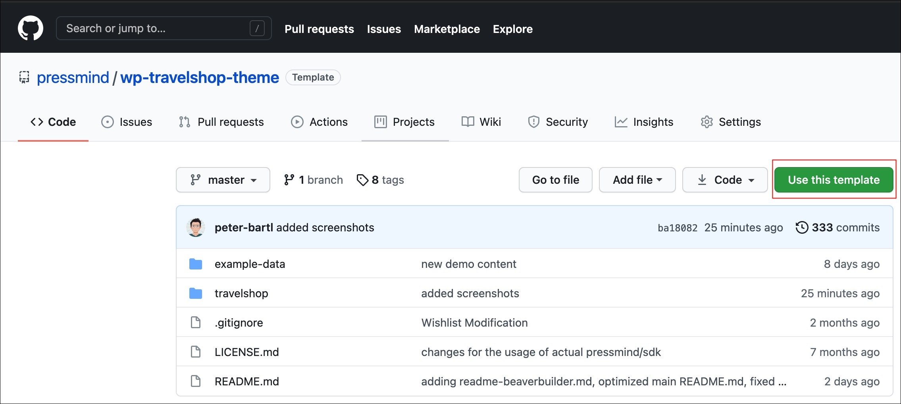
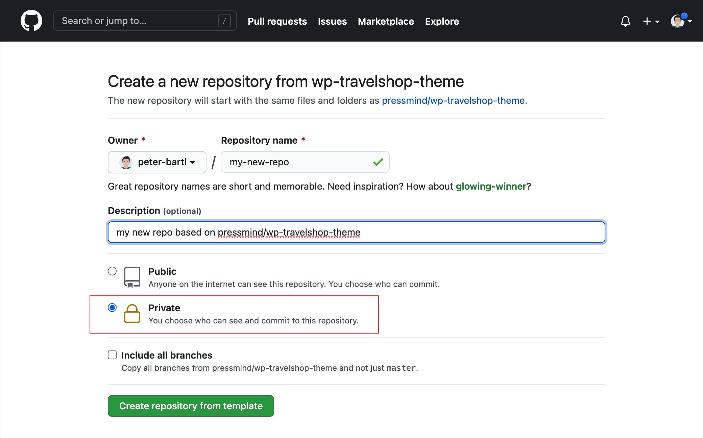
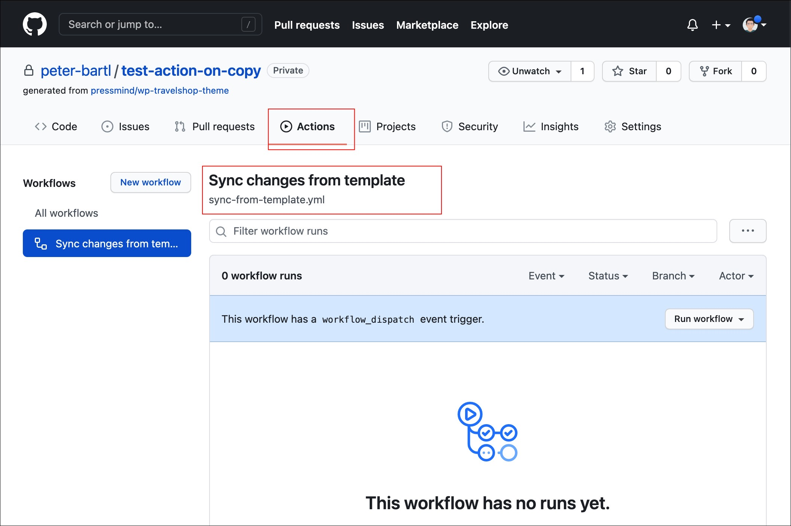
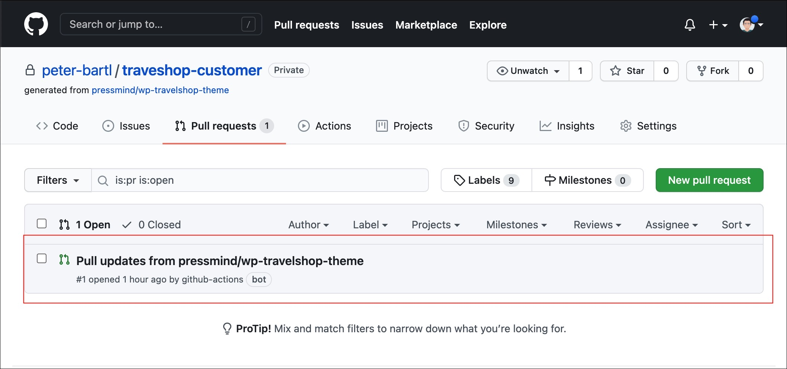

# Track changes in new projects / repos

If you plan to use the travelshop theme, use this way (to track changes and have a quick start)

## 1. Create a new repo based on the travelshop-theme

Go to github.com and click the "use template"-button:


Follow the instructions to create the repo (!make it private):


Or use the shell:
```shell
gh repo create my-new-repo --private --template pressmind/wp-travelshop-theme
```

## 2. Stay in sync using GitHub Workflow
At this point github has created a repo as copy (without any 
connection to the pressmind/wp-travelshop-theme repo).

To still get updates we have created a github workflow that automatically 
creates nightly pull requests to your repo.
```.github/workflows/sync-from-template.yml```
This workflow is automatically enabled, look at your actions panel:


The workflow generates a pull request for the master-branch if the pressmind/wp-travelshop-theme master will change.
So you can merge all changes in a easy way to your code... 

